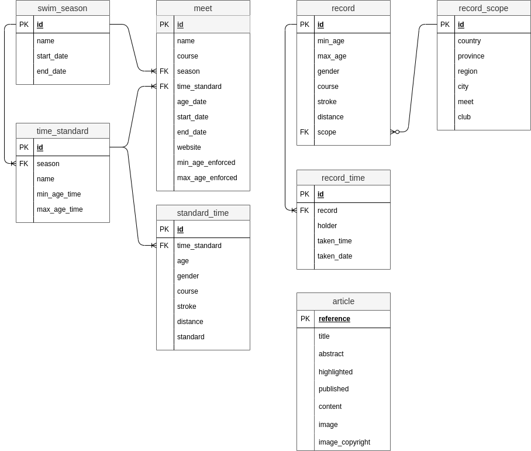

= Geek Swimmers
Hildeberto Mendonca
v0.1.0
:doctype: book
:pdf-page-size: LETTER
:encoding: utf-8
:toc: left
:toclevels: 3
:numbered:

== Configuration

=== User Session

The user session is kept in a encrypted cookie. The cookie is encrypted with the `server.sessionkey` config entry or the `SERVER_SESSION_KEY` environment variable.

== Database Modeling

If you are reading this documentation in the browser, be aware there is also a version available in link:index.pdf[PDF format].

== Go

To upgrade the version of Go, we have to change three files:

- go.mod
- .github/workflows/go.yml
- .github/workflows/golangci-lint.yml